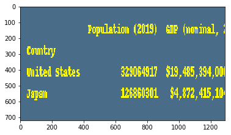

# For_a_little_fun
compare two countries based on population and GDP per capita

## import modules


```python
import wikipedia as wiki
import requests
import urllib.request
import time
from bs4 import BeautifulSoup
import pandas as pd
from PIL import Image, ImageDraw
import matplotlib.pyplot as plt
```

### set the url for data source


```python
url = 'https://www.worldometers.info/world-population/population-by-country/'
```

### read the table data using pandas read_html()


```python
df = pd.read_html(url)
df = df[0]
df = df.rename(columns={'Country (or dependency)': 'Country'})
df = df.drop('#',1)
df = df.set_index('Country')
df.head()
```


<div>
<style scoped>
    .dataframe tbody tr th:only-of-type {
        vertical-align: middle;
    }

    .dataframe tbody tr th {
        vertical-align: top;
    }

    .dataframe thead th {
        text-align: right;
    }
</style>
<table border="1" class="dataframe">
  <thead>
    <tr style="text-align: right;">
      <th></th>
      <th>Population (2019)</th>
      <th>Yearly Change</th>
      <th>Net Change</th>
      <th>Density (P/Km²)</th>
      <th>Land Area (Km²)</th>
      <th>Migrants (net)</th>
      <th>Fert. Rate</th>
      <th>Med. Age</th>
      <th>Urban Pop %</th>
      <th>World Share</th>
    </tr>
    <tr>
      <th>Country</th>
      <th></th>
      <th></th>
      <th></th>
      <th></th>
      <th></th>
      <th></th>
      <th></th>
      <th></th>
      <th></th>
      <th></th>
    </tr>
  </thead>
  <tbody>
    <tr>
      <th>China</th>
      <td>1433783686</td>
      <td>0.43 %</td>
      <td>6135900</td>
      <td>153</td>
      <td>9388211</td>
      <td>-348399.0</td>
      <td>1.7</td>
      <td>38</td>
      <td>60 %</td>
      <td>18.59 %</td>
    </tr>
    <tr>
      <th>India</th>
      <td>1366417754</td>
      <td>1.02 %</td>
      <td>13775474</td>
      <td>460</td>
      <td>2973190</td>
      <td>-532687.0</td>
      <td>2.2</td>
      <td>28</td>
      <td>35 %</td>
      <td>17.71 %</td>
    </tr>
    <tr>
      <th>United States</th>
      <td>329064917</td>
      <td>0.60 %</td>
      <td>1968652</td>
      <td>36</td>
      <td>9147420</td>
      <td>954806.0</td>
      <td>1.8</td>
      <td>38</td>
      <td>82 %</td>
      <td>4.27 %</td>
    </tr>
    <tr>
      <th>Indonesia</th>
      <td>270625568</td>
      <td>1.10 %</td>
      <td>2955025</td>
      <td>149</td>
      <td>1811570</td>
      <td>-98955.0</td>
      <td>2.3</td>
      <td>30</td>
      <td>56 %</td>
      <td>3.51 %</td>
    </tr>
    <tr>
      <th>Pakistan</th>
      <td>216565318</td>
      <td>2.04 %</td>
      <td>4337032</td>
      <td>281</td>
      <td>770880</td>
      <td>-233379.0</td>
      <td>3.6</td>
      <td>23</td>
      <td>35 %</td>
      <td>2.81 %</td>
    </tr>
  </tbody>
</table>
</div>


### read second table 


```python
url = 'https://www.worldometers.info/gdp/gdp-by-country/'
df1 = pd.read_html(url)
df1 = df1[0]
df1 = df1.drop('#',1)
df1 = df1.set_index('Country')
df1.head()
```


<div>
<style scoped>
    .dataframe tbody tr th:only-of-type {
        vertical-align: middle;
    }

    .dataframe tbody tr th {
        vertical-align: top;
    }

    .dataframe thead th {
        text-align: right;
    }
</style>
<table border="1" class="dataframe">
  <thead>
    <tr style="text-align: right;">
      <th></th>
      <th>GDP (nominal, 2017)</th>
      <th>GDP growth</th>
      <th>Population (2017)</th>
      <th>GDP per capita</th>
      <th>Share of World GDP</th>
    </tr>
    <tr>
      <th>Country</th>
      <th></th>
      <th></th>
      <th></th>
      <th></th>
      <th></th>
    </tr>
  </thead>
  <tbody>
    <tr>
      <th>United States</th>
      <td>$19,485,394,000,000</td>
      <td>2.27%</td>
      <td>325084756</td>
      <td>$59,939</td>
      <td>24.08%</td>
    </tr>
    <tr>
      <th>China</th>
      <td>$12,237,700,479,375</td>
      <td>6.90%</td>
      <td>1421021791</td>
      <td>$8,612</td>
      <td>15.12%</td>
    </tr>
    <tr>
      <th>Japan</th>
      <td>$4,872,415,104,315</td>
      <td>1.71%</td>
      <td>127502725</td>
      <td>$38,214</td>
      <td>6.02%</td>
    </tr>
    <tr>
      <th>Germany</th>
      <td>$3,693,204,332,230</td>
      <td>2.22%</td>
      <td>82658409</td>
      <td>$44,680</td>
      <td>4.56%</td>
    </tr>
    <tr>
      <th>India</th>
      <td>$2,650,725,335,364</td>
      <td>6.68%</td>
      <td>1338676785</td>
      <td>$1,980</td>
      <td>3.28%</td>
    </tr>
  </tbody>
</table>
</div>


### join two tables base on country name


```python
df_all = df.join(df1,on='Country')
```


```python
#df_all.head(10)
```


```python
#df_all.sort_values(['GDP (nominal, 2017)',''])
```

### select countries of interest for comaping them


```python
new_df = df_all.loc[['United States','Japan'],['Population (2019)','GDP (nominal, 2017)']]
new_df
```


<div>
<style scoped>
    .dataframe tbody tr th:only-of-type {
        vertical-align: middle;
    }

    .dataframe tbody tr th {
        vertical-align: top;
    }

    .dataframe thead th {
        text-align: right;
    }
</style>
<table border="1" class="dataframe">
  <thead>
    <tr style="text-align: right;">
      <th></th>
      <th>Population (2019)</th>
      <th>GDP (nominal, 2017)</th>
    </tr>
    <tr>
      <th>Country</th>
      <th></th>
      <th></th>
    </tr>
  </thead>
  <tbody>
    <tr>
      <th>United States</th>
      <td>329064917</td>
      <td>$19,485,394,000,000</td>
    </tr>
    <tr>
      <th>Japan</th>
      <td>126860301</td>
      <td>$4,872,415,104,315</td>
    </tr>
  </tbody>
</table>
</div>


### draw the results on a image 


```python
img = Image.new('RGB', (300, 80), color = (73, 109, 137))
 
d = ImageDraw.Draw(img)
d.text((10,10), str(new_df), fill=(255,255,0))
img = img.resize((1290,720))
plt.imshow(img)
plt.show
```


    <function matplotlib.pyplot.show(*args, **kw)>




